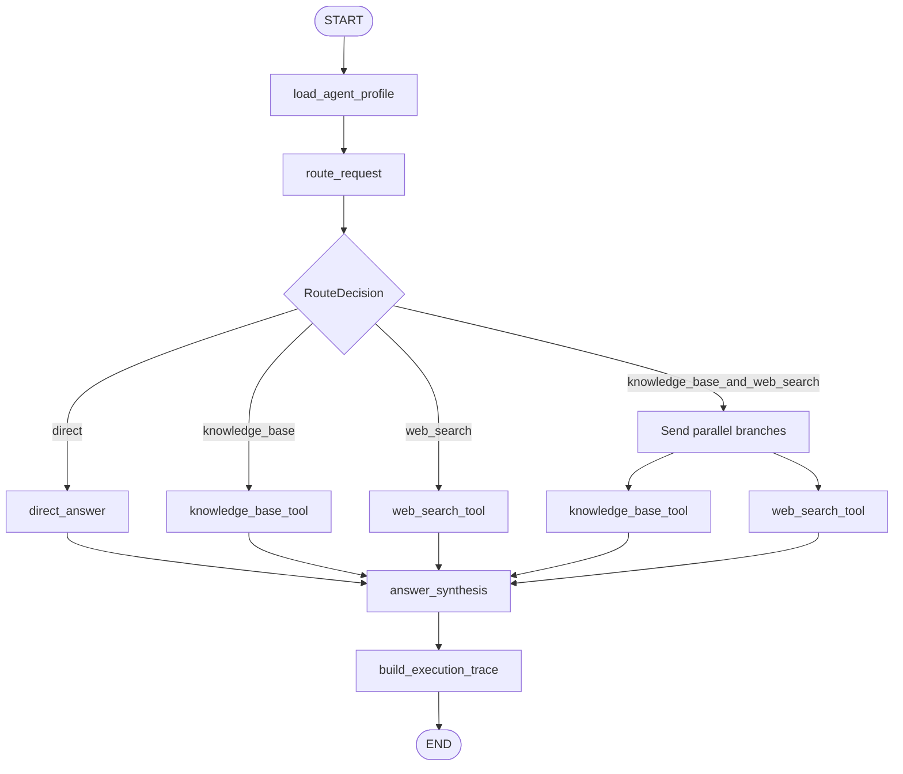

# Agentic RAG Supervisor Design

## Goal

Make SuperMew a LangGraph-orchestrated agent for rice agriculture.  Each user
question is routed to the minimum combination of capabilities required:

- direct LLM response for stable, general questions;
- the existing Agentic RAG workflow for knowledge-base-specific questions;
- Tavily web search for current public information;
- both RAG and web search in parallel when both internal evidence and current
  public information are needed.

The user sees a factual execution trace and source cards, never hidden model
reasoning or chain-of-thought.

## Scope

This change adds an outer LangGraph supervisor around the existing RAG graph.
The current `backend/rag/pipeline.py` remains the knowledge-base subgraph and
keeps its hybrid retrieval, local reranking, evidence grading, query rewrite,
and HITL handling.

The project-level `AGENTS.md` describes the rice-agriculture knowledge base:
its intended subject area, typical covered material, and the cases that should
prefer a direct answer or web search.

The change retains the existing PostgreSQL/Redis conversation storage, SSE
streaming, RBAC, document upload, and source citations.

## Routing Policy

`route_request` returns a structured `RouteDecision` with exactly one of:

| Route | Meaning |
| --- | --- |
| `direct` | Answer from the configured chat model without a retrieval tool. |
| `knowledge_base` | Run the existing Agentic RAG subgraph. |
| `web_search` | Run Tavily and answer from normalized web results. |
| `knowledge_base_and_web_search` | Run RAG and Tavily concurrently, then synthesize both evidence sets. |

The router uses `AGENTS.md` and recent conversation context.  Rice-related
questions do not automatically mean RAG: broad, stable agricultural knowledge
may use `direct`.  Uploaded-material specifics, numerical results, protocols,
or requests that require evidence should use `knowledge_base`.  Current
policies, market prices, current outbreaks, news, and fresh public research
should use `web_search`.  Questions requiring both use the parallel route.

## Graph Structure

The outer graph uses `StateGraph`, conditional edges for the first three
single-path routes, and `Send` for the dual-path route.  The existing RAG
graph is called as a subgraph from `knowledge_base_tool`; it is not duplicated.

## State and Contracts

The supervisor state holds the question, recent context, parsed knowledge-base
profile, route decision, RAG result, normalized web results, execution events,
and final source sections.  Parallel branch values use reducers so RAG and web
updates can safely join before synthesis.

`RouteDecision` has a route, a concise user-displayable reason, and optional
flags indicating the need for citations and current information.  The
user-displayable reason must describe an observable decision (for example,
“requires current public information”), not internal model reasoning.

Tavily results are normalized to title, URL, domain, snippet, score, and
optional publication date.  The web tool uses `TAVILY_API_KEY` and returns a
typed result rather than raw provider output.  Search failure records an event
and allows synthesis to proceed with any available RAG evidence or a direct
answer that clearly says web search was unavailable.

## `AGENTS.md`

The file is loaded per request so editing it takes effect without changing
Python code.  It states that the knowledge base concerns rice agriculture,
including cultivation, varieties, breeding, pests and diseases, soil and
fertilizer, water management, machinery, and uploaded project material.  It
directs the router to prefer web search for current policy, news, market, and
outbreak information, and to avoid the knowledge-base tool for unrelated
questions.

## User Experience

The answer remains separate from operational metadata.  The existing RAG
detail panel is extended with an execution trace that can show:

- selected route;
- whether the RAG subgraph ran and its existing retrieval/evidence events;
- whether Tavily ran, result count, and any non-sensitive failure;
- whether direct answering was selected.

Source cards are split into Knowledge-base sources and Web sources.  Each web
source displays a title, domain, snippet, and clickable source link.  No
chain-of-thought, private prompt, API key, or hidden reasoning is included.

## Configuration

`TAVILY_API_KEY` is copied from the existing `llamaindex` Conda environment
into SuperMew's ignored `.env`.  Tavily's Python package is installed in the
`Agentrag` environment.  Existing local `bge-m3` embeddings and local
`bge-reranker-v2-m3` reranking continue unchanged.

## Validation

Tests cover structured routing for all four routes, parallel-branch joins,
knowledge-base result propagation, normalized Tavily sources, web-search
failure fallback, and trace/source schema compatibility.  Frontend tests cover
route-event rendering and web-source cards.  Existing RAG and local reranker
tests remain green.

## Non-goals

This change does not alter document indexing, Milvus schema, conversation
summary strategy, authentication, or the existing RAG evidence-grading logic.
It does not display chain-of-thought or implement editable knowledge-base
profiles in the UI.
